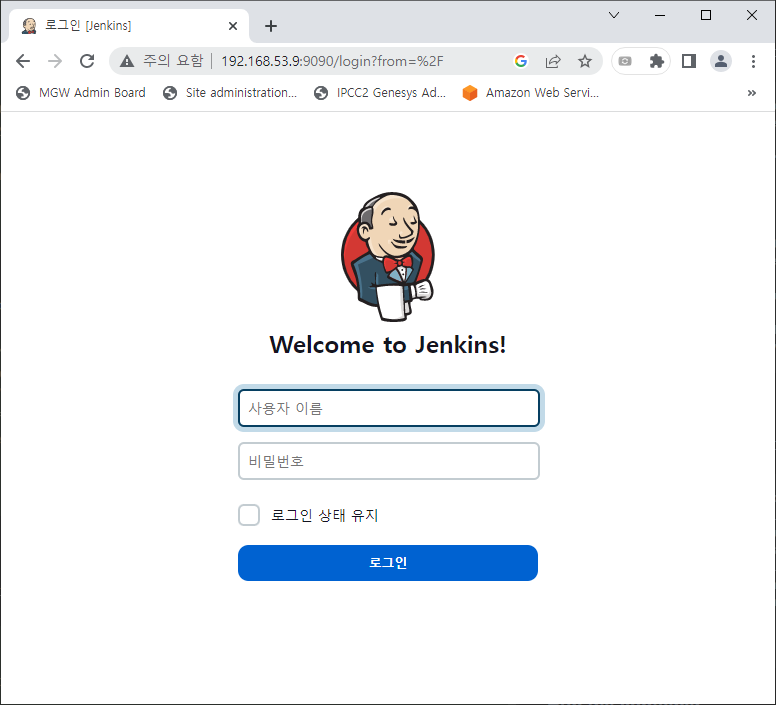

# Install HAProxy using Docker
## Description
HAProxy는 무료이며 고가용성의 오픈 소스 로드 밸런싱 애플리케이션이다. TCP와 HTTP 기반 요청을 다수의 서버 사이에서 프록시 한다.
## How to write a haproxy.cfg and start HAProxy Server
### Overview
https://www.haproxy.com/documentation/hapee/latest/configuration/config-sections/overview/  
HAProxy 설정 파일인 haproxy.cfg 파일은 하기와 같은 구조를 갖는다.
```text
global
 # process-level settings here

defaults
 # defaults here

frontend
 # a frontend that accepts requests from clients

backend
 # servers that fulfill the requests
```
HAProxy 공식 홈페이지에서 제공하는 Defaults 구성 내용은 하기와 같다.
```text
defaults
   mode http
   log global
   balance roundrobin
   timeout client 30s

frontend public_web_servers
   bind *:80
   default_backend public_web_servers

frontend api_servers
   bind *:8000
   default_backend api_servers

backend public_web_servers
   server s1 192.168.1.25:80
   server s2 192.168.1.26:80

backend api_servers
   server s1 192.168.1.27:8000
   server s2 192.168.1.28:8080
```
### Create a Dockerfile
Jenkins 리스닝 포트 정보를 확인한다.
```text
PORTS                                                                                      NAMES
0.0.0.0:8080->8080/tcp, :::8080->8080/tcp, 0.0.0.0:50000->50000/tcp, :::50000->50000/tcp   jenkins-blueocean
2375/tcp, 0.0.0.0:2376->2376/tcp, :::2376->2376/tcp                                        jenkins-docker
0.0.0.0:6000->22/tcp, :::6000->22/tcp                                                      git-server
```
상기 내용을 통해서 `8080` 포트를 리스닝하고 있음을 알 수 있다. haproxy.cfg 파일을 하기와 같이 구성하여 생성한다.
```text
defaults
   mode http
   log global
   balance roundrobin
   timeout client 30s

frontend jenkins_server
   bind *:9090 --> 1번부터 1023까지의 Privileged Port는 피한다.
   default_backend jenkins_server

backend jenkins_server
   server s1 192.168.53.9:8080
```
haproxy.cfg 파일이 있는 위치에 Dockerfile을 하기와 같이 작성한다.
```text
FROM haproxy:2.6
COPY haproxy.cfg /usr/local/etc/haproxy/haproxy.cfg
```
### Build a image
하기 명령어를 실행하여 HAProxy 이미지를 빌드한다.
```text
[root@localhost haproxy]# sudo docker build --rm -t my-haproxy .
Sending build context to Docker daemon  3.072kB
Step 1/2 : FROM haproxy:2.6
2.6: Pulling from library/haproxy
bb263680fed1: Pull complete 
de63664ceeef: Pull complete 
b90003ae7981: Pull complete 
d18d3cfb5667: Pull complete 
Digest: sha256:dd7f5cb01022bf04703b8b222931049fb5f1240d76714613cf90551c885e687d
Status: Downloaded newer image for haproxy:2.6
 ---> d90c633c344d
Step 2/2 : COPY haproxy.cfg /usr/local/etc/haproxy/haproxy.cfg
 ---> eb20dc06f5d2
Successfully built eb20dc06f5d2
Successfully tagged my-haproxy:latest
```
### Test the configuration file
하기 명령어를 실행하여 haproxy.cfg 파일의 문법에 이상이 없는지 확인한다.
```text
[root@localhost haproxy]# docker run -it --rm --name haproxy-syntax-check my-haproxy haproxy -c -f /usr/local/etc/haproxy/haproxy.cfg
[NOTICE]   (1) : haproxy version is 2.6.8-ab6ee7f
[NOTICE]   (1) : path to executable is /usr/local/sbin/haproxy
[WARNING]  (1) : config : missing timeouts for backend 'jenkins_server'.
   | While not properly invalid, you will certainly encounter various problems
   | with such a configuration. To fix this, please ensure that all following
   | timeouts are set to a non-zero value: 'client', 'connect', 'server'.
Warnings were found.
Configuration file is valid
```
### Run the container
하기 명령어를 실행하여 HAProxy 컨테이너를 실행시킨다.
```shell
docker run -d \
--name my-running-haproxy \
--sysctl net.ipv4.ip_unprivileged_port_start=0 \
-p 9090:9090 \
my-haproxy
```
`9090` 포트를 이용하여 URL에 접속한다.  
  
### Configure HTTPS(SSL/TLS)
https://www.haproxy.com/blog/haproxy-ssl-termination/