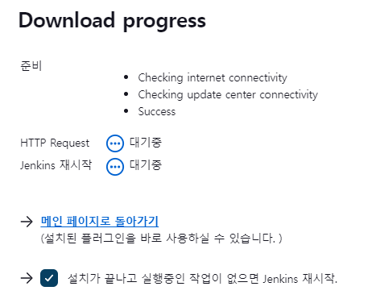

# HTTP Request 플러그인을 이용하여 Test 하는 법
## 플러그인 설치
1. Jenkins에 로그인 한다.
2. Jenkins 관리를 클릭한다.
3. 플러그인 관리를 클릭한다.
4. 좌측 Available plugins를 클릭한다.
5. `http request`를 검색한다.
6. 설치 후 Jenkins를 리스타트 한다.

## 사용법
https://www.jenkins.io/doc/pipeline/steps/http_request/  
https://plugins.jenkins.io/http_request/  
