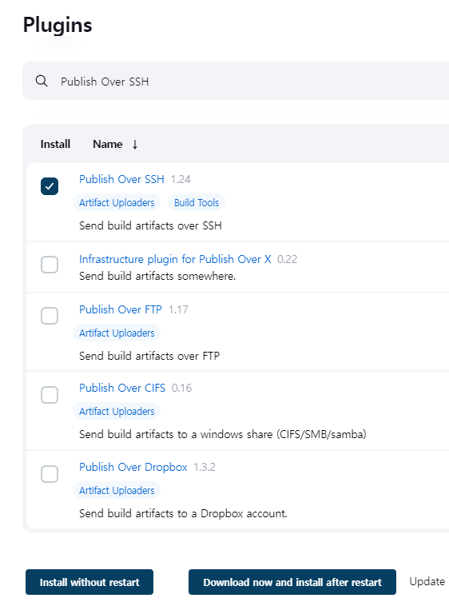
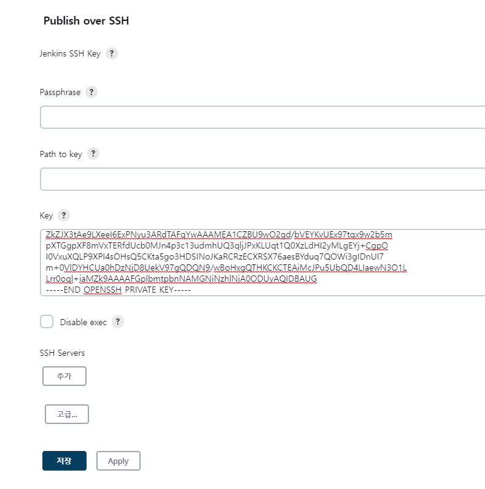

## Jenkins Publish Over SSH를 이용하여 원격 배포하기
Jenkins 대시보드에서 하기와 같이 Publish Over SSH 플러그인을 설치합니다.  
  

Jenkins 서버에서 원격 서버에 접속하기 위해서 Jenkins가 설치되어 있는 컨테이너 내부로 이동하여 SSH Key를 생성하고
공개키를 원격 서버에 등록한다. 이미 Private Git 서버와 연동하기 위해서 ~/.ssh 디렉토리 내부에 공개키와 개인키가
생성되어 있다.
```text
jenkins@0cb78e604852:~/.ssh$ ls -lth
total 12K
-rw-r--r-- 1 jenkins jenkins  574 Feb  6 07:37 id_rsa.pub
-rw------- 1 jenkins jenkins 2.6K Feb  6 07:37 id_rsa
-rw-r--r-- 1 jenkins jenkins  444 Feb  6 03:29 known_hosts
```
이제 Jenkins 서버가 아닌 원격 서버에 Jenkins에서 SSH 연결을 수행할 계정으로 접속 후 공개키를 등록해야 한다.
만약 계정 이름이 'youngwoo'라면 /home/youngwoo/.ssh 디렉토리에 있는 authorized_keys 파일에 위에서 생성한
공개키를 등록한다. 만약 해당 파일이 존재하지 않으면 직접 생성하여 공개키 내용을 복사해서 붙여넣는다.
```text
jenkins@0cb78e604852:~/.ssh$ ls -ltih
total 12K
104850052 -rw-r--r-- 1 jenkins jenkins  574 Feb  6 07:37 id_rsa.pub
104850050 -rw------- 1 jenkins jenkins 2.6K Feb  6 07:37 id_rsa
104850051 -rw-r--r-- 1 jenkins jenkins  444 Feb  6 03:29 known_hosts
jenkins@0cb78e604852:~/.ssh$ cat id_rsa.pub 
ssh-rsa AAAAB3NzaC1yc2EAAAADAQABAAABgQC1dBzksB0Iv0HVvPfwa0FuwO8q6itmxAoaz0npDLh9/ASwr54vyl1IFvIYm+a8olEgbEBlaT3iFNsGERc7MIQHQo+qHhfa9UCnYGpNwA4UK1rbXEC04bRKZSzZ420tZE2JFdvh1gelldMNADOs/xCny3y6jA4cS1aqH1DIOu5TzWRF01oZA/Ob6HaQQl9xy664ko94B+BHK4qnJilt5tASA81kyygxHJl7U8a652CPGOBzzBIAA0bVVOH0PTNu+QBixYhUmtuqUOaohxuH3bd870Js0B1PWR6D0HB96V3l1Z811bSvTgL/JfJzIaLj4T7IleFZdr5hfzHziAMQ5xxo5XvuVr36SI6csFhNTmWmeuGC1qcm4s79k0iusRcKgTcuoRESDhAkqbcih8b6LD/zajDcKGL8YJ6eOGSKe7FaSToxK4Sk/VAIThNrExGahfYwpSKdDdChvMA4xOX/ti7MLoGPzgZxN5KPScMc9Jwtg/+Gx6dhPa/e5+QBpN/ehJc= jenkins@0cb78e604852
```
이제 다시 Jenkins 메인 화면으로 돌아와서 Jenkins 관리 -> 시스템 설정을 클릭한다. 하단의 'Publish Over SSH'
항목에서 개인키 내용을 Key에 복사해서 넣는다.  
  
