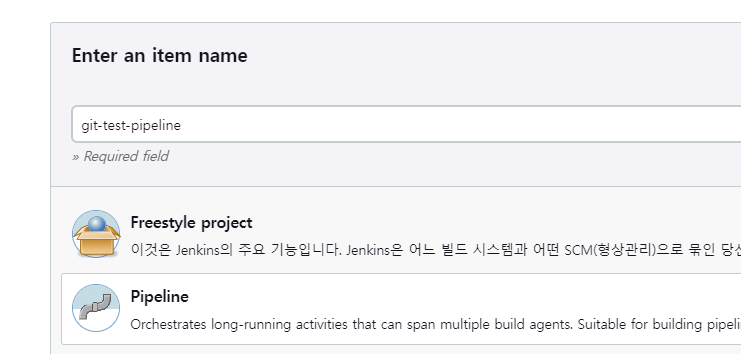
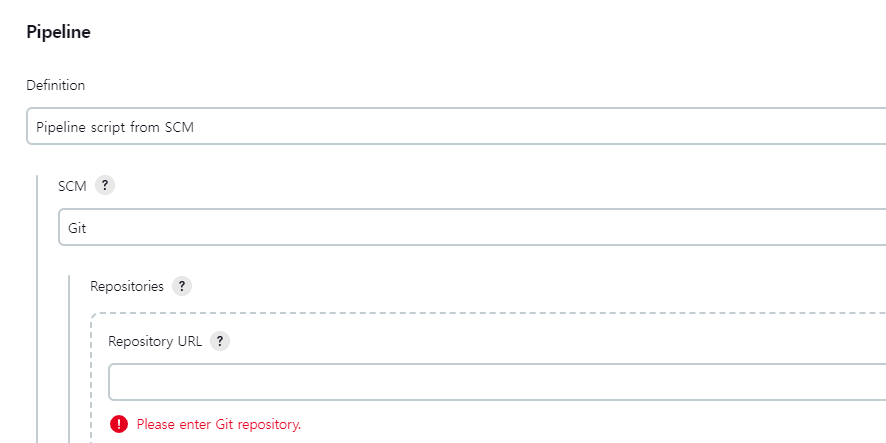
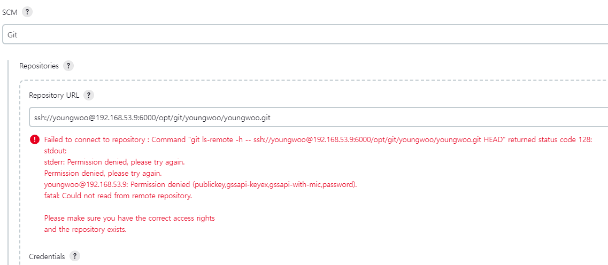
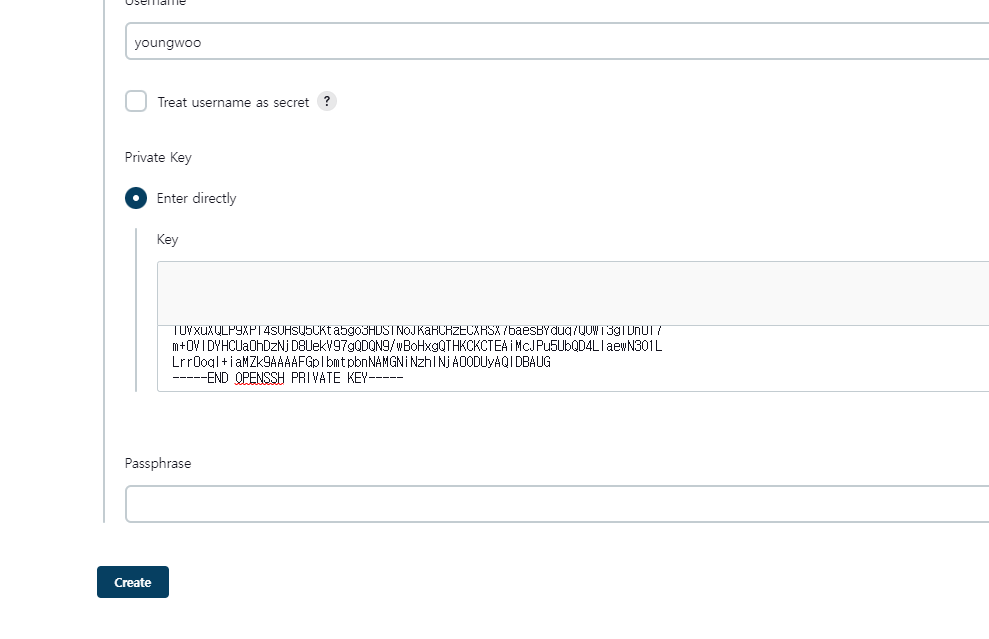
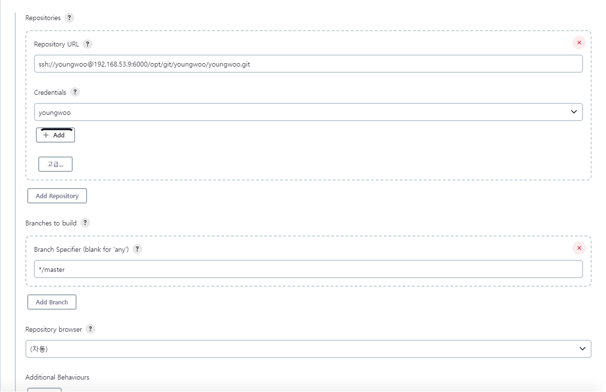
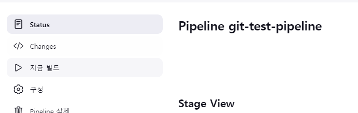
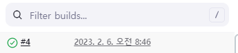
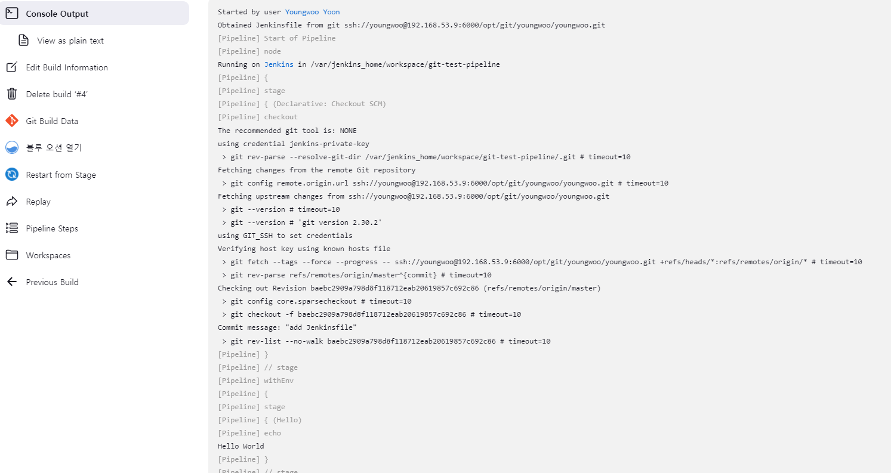

## Jenkins-Git 연동하는 법
(1) item을 하나 생성한다.  
  

(2) 하기와 같이 SCM에서 Git을 선택한다.  
  

(3) 사설 Git 주소를 기입합니다.  
  

(4) SSH 공개키와 비밀키 생성하기  
Jenkins 컨테이너로 접근하여 ssh-keygen 명령어를 실행합니다.
```text
jenkins@0cb78e604852:/$ ssh-keygen
Generating public/private rsa key pair.
Enter file in which to save the key (/var/jenkins_home/.ssh/id_rsa): 
Enter passphrase (empty for no passphrase): 
Enter same passphrase again: 
Your identification has been saved in /var/jenkins_home/.ssh/id_rsa
Your public key has been saved in /var/jenkins_home/.ssh/id_rsa.pub
The key fingerprint is:
SHA256:I8wxUQDRQoADzB3VA2OaD8qcWrYuYVZcWY+kYPdpu38 jenkins@0cb78e604852
The key's randomart image is:
+---[RSA 3072]----+
|=.o**XB=.        |
|oo..Bo*++        |
| ..+.oo=..       |
|o oooo.o.        |
| =+  .+.S        |
|o= .   ...       |
|+..    .         |
|..      .  E     |
| ..      ..      |
+----[SHA256]-----+
```
생성된 공개키와 개인키를 확인합니다.
```text
jenkins@0cb78e604852:~/.ssh$ ls -ltih
total 12K
104850052 -rw-r--r-- 1 jenkins jenkins  574 Feb  6 07:37 id_rsa.pub
104850050 -rw------- 1 jenkins jenkins 2.6K Feb  6 07:37 id_rsa
```

(5) Jenkins에 Credentials 등록하기  
Jenkins에 Credentials를 등록할 때에는 SSH 개인키가 필요합니다. id_rsa의 내용을 복사합니다.  

(6) Jenkins에서 Manage Credentials를 통해서 하기와 같이 Credentials를 추가합니다.  
  
  

(7) Git 레포지토리 서버에 공개키를 등록해야 합니다.  
먼저 Git 서버로 접속하여 youngwoo 계정으로 로그인 후 홈 디렉토리의 .ssh 디렉터리로 이동합니다.
```text
[youngwoo@d880e49ceaaa .ssh]$ ls -ltih
total 4.0K
36825643 -rw-r--r-- 1 youngwoo youngwoo 181 Feb  6 07:03 known_hosts
```
authorized_keys 파일이 없으므로 생성해주고 755 권한을 부여합니다.
```text
touch authorized_keys
chmod 755 authorized_keys
```
이후 아까 복사한 id_rsa.pub 키를 복사해서 붙여 넣습니다.  
(8) 하기 명령어를 수행하여 sshd를 재시작 합니다.
```text
systemctl restart sshd
```
(9) Jenkins 화면으로 이동하면 빨간 문구가 사라진 것을 확인할 수 있습니다. Credentials는 이전에 생성한 것을 선택합니다.  
  
(10) Jenkinsfile에 하기 내용을 입력하고 Git 서버로 Push 후 빌드를 수행합니다.
```text
pipeline {
    agent any

    stages {
        stage('Hello') {
            steps {
                echo 'Hello World'
            }
        }
    }
}
```
  
  
  